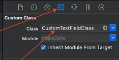

# Material UI Outlined Floating TextField For IOS Swift Project


A customizable, reusable outlined floating text field component for iOS built on Material Design principles.

## Overview

The **MaterialOutlinedFloatingTextField** is a reusable and customizable text field component for iOS applications. Built with Material Design principles, this text field supports floating labels, outlined styles, and various customization options, making it ideal for modern iOS app development.

## Features

- **Floating Label**: Animates when the field is focused or filled.
- **Customizable Colors**: Set different outline colors for normal, editing, and required states.
- **Secure Text Entry**: Option to toggle secure text entry for password fields.
- **IBInspectable Properties**: Easily customizable in Interface Builder.
- **Accessibility**: Fully accessible for all users.

## Installation

### 1. Add the Pod

To use **MaterialOutlinedFloatingTextField**, you need to include the `MaterialComponents` pod in your project. Open your `Podfile` and add the following line:

```ruby
pod 'MaterialComponents'
```

### 2. Install the Pods

Run the following command in your terminal:

```bash
pod install
```

### 3. Open the project

### 4. Add the Swift File to Your Project

### 5. Copy the below class code from this README and paste it into the newly created Swift file.

## Class Code

Here is the complete implementation of the `CustomOutlinedFloatingTextField`:

```swift
import UIKit
import MaterialComponents

@IBDesignable
class CustomOutlinedFloatingTextField: UIView {
    
    private let textField = MDCOutlinedTextField()
    
    // Label text
    @IBInspectable
    var titleText: String? {
        didSet {
            textField.label.text = titleText
        }
    }
    
    // Placeholder text
    @IBInspectable
    var placeholderText: String? {
        didSet {
            textField.placeholder = placeholderText
        }
    }
    
    // Outline color for editing state
    @IBInspectable
    var outlineColorEditing: UIColor = .blue {
        didSet {
            textField.setOutlineColor(outlineColorEditing, for: .editing)
        }
    }
    
    // Outline color for normal state
    @IBInspectable
    var outlineColorNormal: UIColor = .gray {
        didSet {
            textField.setOutlineColor(outlineColorNormal, for: .normal)
        }
    }
    
    // Outline color for required state
    @IBInspectable
    var outlineColorRequired: UIColor = .red
    
    @IBInspectable
    var cornerRadius: CGFloat = 5.0 {
        didSet {
            textField.layer.cornerRadius = cornerRadius
            textField.layer.masksToBounds = true
        }
    }

    // Flag to indicate if this field is required
    @IBInspectable
    var isRequired: Bool = false {
        didSet {
            // Reset border color when isRequired changes
            if !isRequired {
                textField.setOutlineColor(outlineColorNormal, for: .normal)
            }
        }
    }

    // Expose UITextField properties
    var text: String? {
        get {
            return textField.text
        }
        set {
            textField.text = newValue
        }
    }

    var isSecureTextEntry: Bool {
        get {
            return textField.isSecureTextEntry
        }
        set {
            textField.isSecureTextEntry = newValue
        }
    }

    var placeholder: String? {
        get {
            return textField.placeholder
        }
        set {
            textField.placeholder = newValue
        }
    }

    var font: UIFont? {
        get {
            return textField.font
        }
        set {
            textField.font = newValue
        }
    }

    var textColor: UIColor? {
        get {
            return textField.textColor
        }
        set {
            textField.textColor = newValue
        }
    }

    var textAlignment: NSTextAlignment {
        get {
            return textField.textAlignment
        }
        set {
            textField.textAlignment = newValue
        }
    }

    var delegate: UITextFieldDelegate? {
        get {
            return textField.delegate
        }
        set {
            textField.delegate = newValue
        }
    }

    var returnKeyType: UIReturnKeyType {
        get {
            return textField.returnKeyType
        }
        set {
            textField.returnKeyType = newValue
        }
    }

    var keyboardType: UIKeyboardType {
        get {
            return textField.keyboardType
        }
        set {
            textField.keyboardType = newValue
        }
    }

    var autocorrectionType: UITextAutocorrectionType {
        get {
            return textField.autocorrectionType
        }
        set {
            textField.autocorrectionType = newValue
        }
    }

    var autocapitalizationType: UITextAutocapitalizationType {
        get {
            return textField.autocapitalizationType
        }
        set {
            textField.autocapitalizationType = newValue
        }
    }

    var isEnabled: Bool {
        get {
            return textField.isEnabled
        }
        set {
            textField.isEnabled = newValue
        }
    }

    var clearButtonMode: UITextField.ViewMode {
        get {
            return textField.clearButtonMode
        }
        set {
            textField.clearButtonMode = newValue
        }
    }

    override func resignFirstResponder() -> Bool {
        return textField.resignFirstResponder()
    }

    override func becomeFirstResponder() -> Bool {
        return textField.becomeFirstResponder()
    }

    // Additional methods
    func addTarget(_ target: Any?, action: Selector, for controlEvents: UIControl.Event) {
        textField.addTarget(target, action: action, for: controlEvents)
    }

    override init(frame: CGRect) {
        super.init(frame: frame)
        setupTextField()
    }

    required init?(coder: NSCoder) {
        super.init(coder: coder)
        setupTextField()
    }
    
    private func setupTextField() {
        // Add the text field to the custom view
        addSubview(textField)
        
        // Set translatesAutoresizingMaskIntoConstraints to false for Auto Layout
        textField.translatesAutoresizingMaskIntoConstraints = false
        
        // Constraints for the text field
        NSLayoutConstraint.activate([
            textField.leadingAnchor.constraint(equalTo: leadingAnchor),
            textField.trailingAnchor.constraint(equalTo: trailingAnchor),
            textField.topAnchor.constraint(equalTo: topAnchor),
            textField.bottomAnchor.constraint(equalTo: bottomAnchor)
        ])
        
        // Add target for editing did end
        textField.addTarget(self, action: #selector(textFieldDidEndEditing), for: .editingDidEnd)
    }

    @objc private func textFieldDidEndEditing() {
        // Check if the field is required and empty
        if isRequired && (textField.text?.isEmpty ?? true) {
            // Set border color to red
            textField.setOutlineColor(outlineColorRequired, for: .normal)
        } else {
            // Reset to normal outline color
            textField.setOutlineColor(outlineColorNormal, for: .normal)
        }
    }
}
```
---

## Usage

### 1. Using in Interface Builder (Storyboard/XIB)

You can easily add **MaterialOutlinedFloatingTextField** to your project using Interface Builder. Follow these steps:

1. Drag and drop a `UIView` from the object library onto your view controller.
2. Set the `UIView`'s class to `CustomOutlinedFloatingTextField` in the **Identity Inspector** (you can refer to the screenshot for help).



No need to worry—this `UIView` will behave like a fully functional text field as everything is managed internally within the class. You can still use **delegates** and access all the usual `UITextField` properties seamlessly.

### 2. Programmatically Create an Instance

You can initialize the text field programmatically as follows:

```swift
let textField = CustomOutlinedFloatingTextField()
textField.titleText = "Your Label"
textField.placeholderText = "Enter text"
textField.frame = CGRect(x: 20, y: 100, width: 300, height: 60)
self.view.addSubview(textField)
```

### Customize the text field

You can customize the text field using `IBInspectable` properties in Interface Builder or programmatically:

```swift
textField.outlineColorEditing = .blue
textField.outlineColorNormal = .gray
textField.outlineColorRequired = .red
textField.isRequired = true
textField.textColor = .black
textField.font = UIFont.systemFont(ofSize: 16)
```

## Examples

Here are some examples of the **MaterialOutlinedFloatingTextField** in action:


## Contributing

Contributions are welcome! Please feel free to submit a pull request or create an issue for any suggestions or improvements.

<!--## License

//This project is licensed under the MIT License - see the [LICENSE](LICENSE) file for details.-->

## Contact

If you have any questions or feedback, please reach out to me:

- **Email:** kaushalnagar997@gmail.com
- **GitHub:** [Kaushal_Nagar](https://github.com/Kaushal-Nagar)
